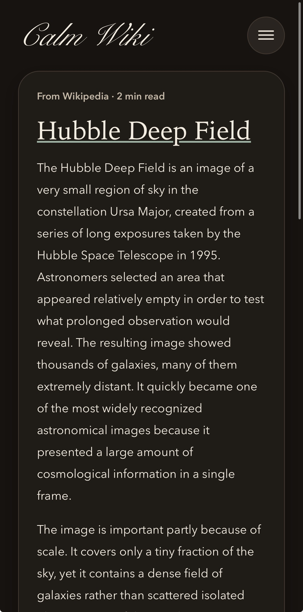
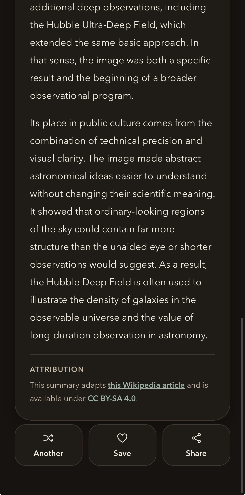
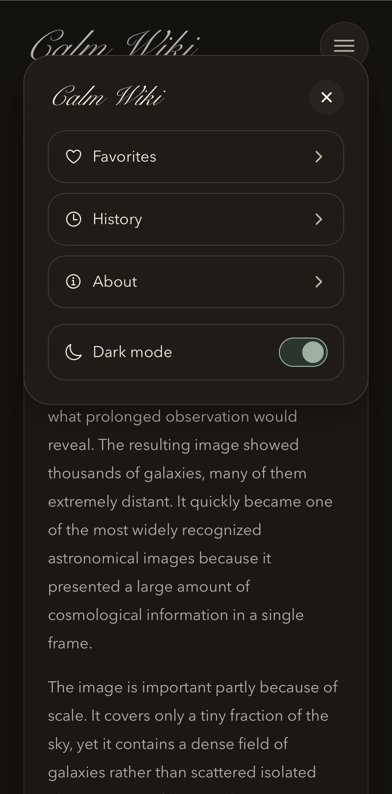
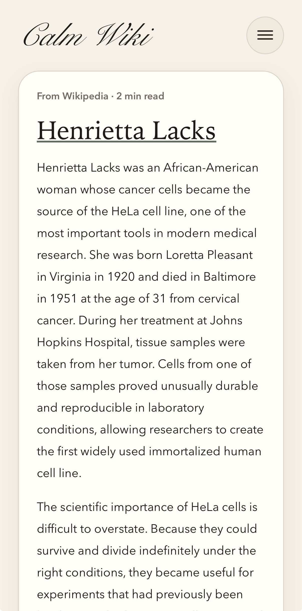
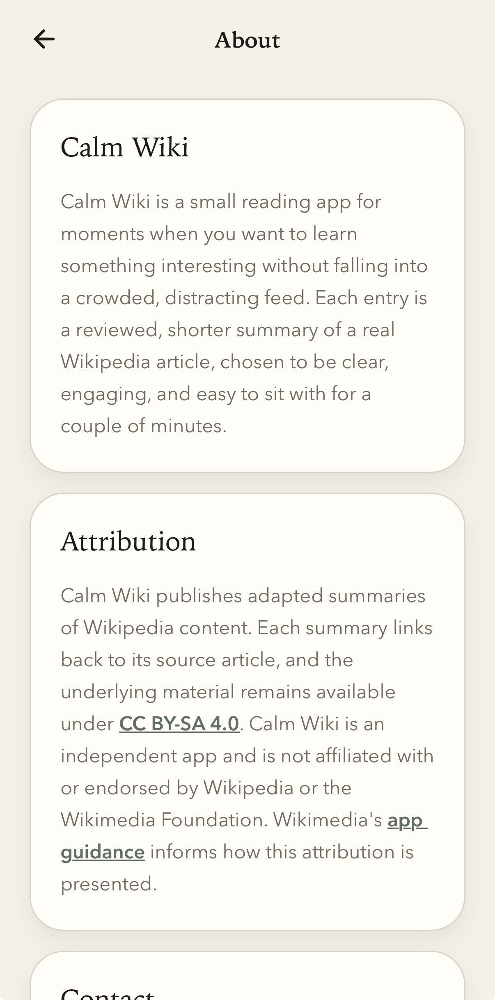
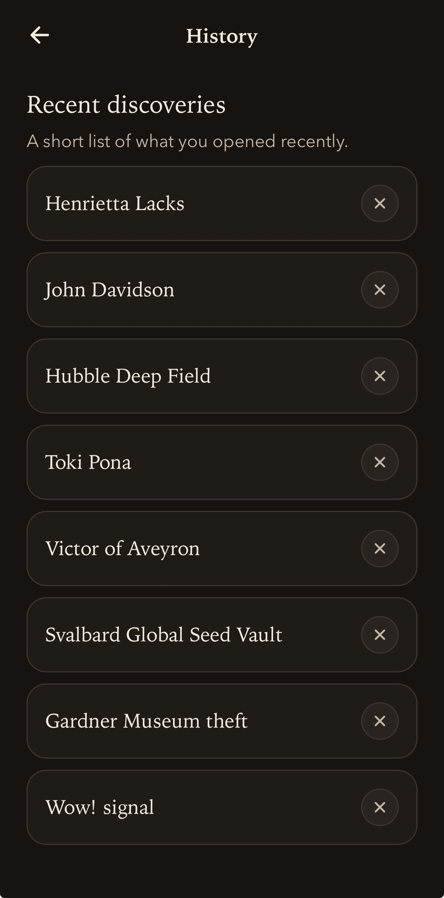

# Calm Wiki

### [calm-wiki.expo.app](https://calm-wiki.expo.app/)

A mobile app for reading two-minute summaries of interesting Wikipedia articles.

Calm Wiki is a mobile-first Expo / React Native app built around a simple idea: open the app, read the AI-generated summaries of a couple of hand-selected interesting Wikipedia articles, and move on. The app is intentionally quiet, text-first, and lightweight. The actual primary intent of the app is to practice React Native development and App Store / PlayStore deployment, which is a WIP.

# Screenshots

<p>
  &nbsp;&nbsp;&nbsp;&nbsp;
  &nbsp;&nbsp;&nbsp;&nbsp;
  &nbsp;&nbsp;&nbsp;&nbsp;
  &nbsp;&nbsp;&nbsp;&nbsp;
  &nbsp;&nbsp;&nbsp;&nbsp;
  
</p>

## What it does

- Serves curated two-minute text summaries of interesting Wikipedia articles (in v1, "interesting" == "interesting to the app developer")
- Lets you add and remove favorite articles
- It keeps a reading history, from which you can remove summaries that don't spark joy.
- Supports light and dark mode

## Stack

- Expo + React Native
- Expo Router
- TypeScript
- Supabase
- AsyncStorage

## Run locally

```bash
npm install
cp .env.example .env
npm start
```

Then fill in the Supabase values in `.env` and open the app in Expo Go, iOS Simulator, Android Emulator, or the browser.

Useful commands:

```bash
npm run ios
npm run android
npm run web
npm run typecheck
```

## Notes

The app only reads published entries from Supabase. Article selection, summarizing and review happen outside the mobile app, with a small set of scripts in `scripts/` for building and importing approved entries.

Summaries adapt Wikipedia content. Source links and attributions are placed in the relevant places in the app according to [Wikimedia Developer App Guidelines](https://foundation.wikimedia.org/wiki/Legal:Wikimedia_Developer_App_Guidelines).
